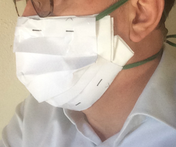

# Introduction
This face mask has been designed and created by a veterinary practitionner. The mask is made of a US letter paper sheet, a piece of cloth, and two ties. It can be done in less than 10 minutes. 

# Tutorial
Click on this link to access the step-by-step instructions: <a href="http://papermask.github.io/papermask/FaceMaskTutorial.pdf " target="_blank"> Face Mask Tutorial </a>

# Mask Pattern
* <a href="http://papermask.github.io/papermask/USPattern.pdf" target="_blank"> Mask pattern  (US Letter Size) </a>

## Contact/Information
For information on the mask, send an e-mail to mypapermask@gmail.com 

This mask does not replace the protective measures recommended by the authorities in the COVID-19 crisis. 

<a href="https://papermask.github.io/papermask/">French version </a> 
